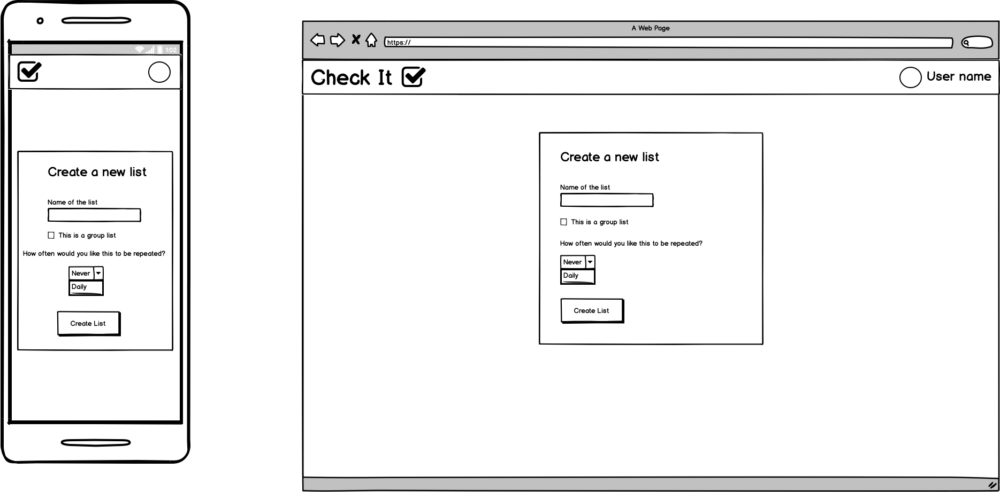

# Checklist App

This app aims to help users manage checklists of tasks to avoid the hassle of having to remember everything in our busy lives. The app will allow you to:
- Create new lists with an accompanying title, description (optional) and thumbnail image (optional)
- Edit current lists, including the ability to:
    - Check items off after you complete them
    - Reset lists to uncheck all list items
    - Add list items
    - Delete list items
    - Rearrange list items
- Delete lists

You will also be able to mark lists to be repeated daily or weekly which will automatically reset the list accordingly.

Using the app requires an account which allows your list data to be synchronised between multiple devices so that you can use the app on your phone or computer and pick up right where you left off.

## Implementation Plan

The development of this project is being tracked with the Github Projects section of this repository.

## Wireframes

##### Landing Page

##### Log In/Sign Up Page

##### Dashboard Page

##### User Profile Page

##### Saved Lists Page

##### Create List Page

##### Edit List Page

##### View List Page
