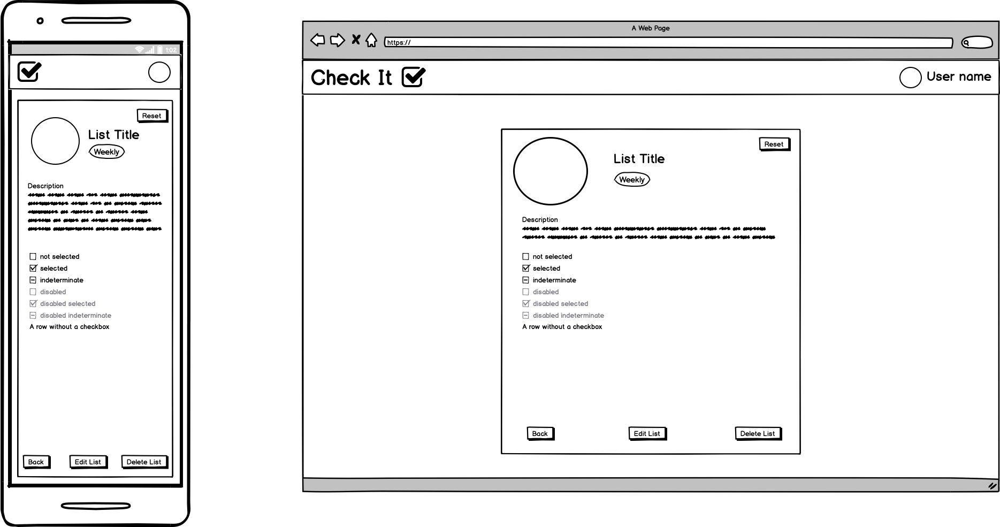
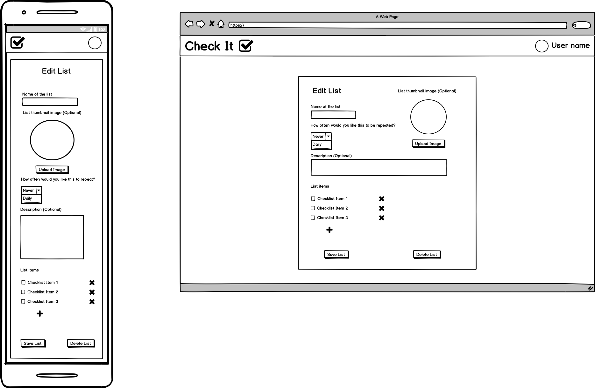
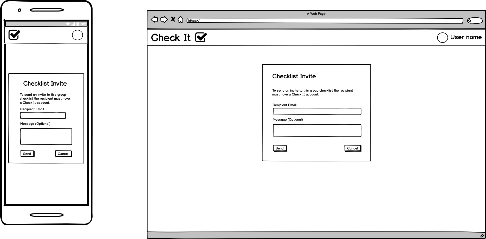
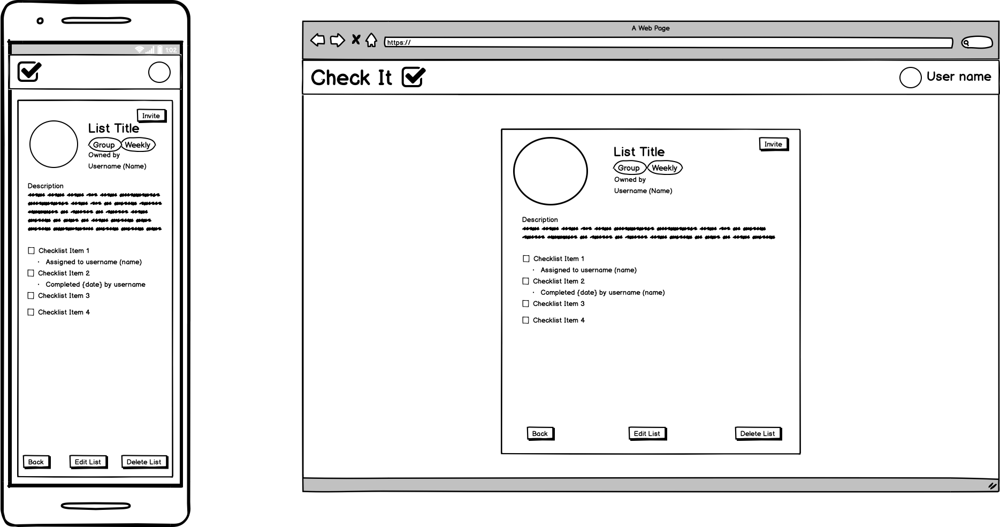
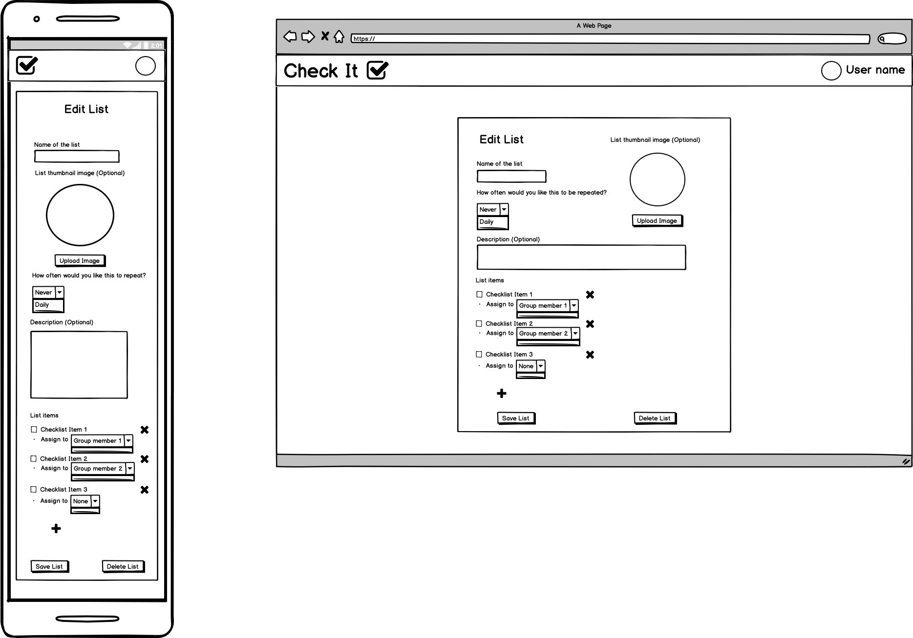
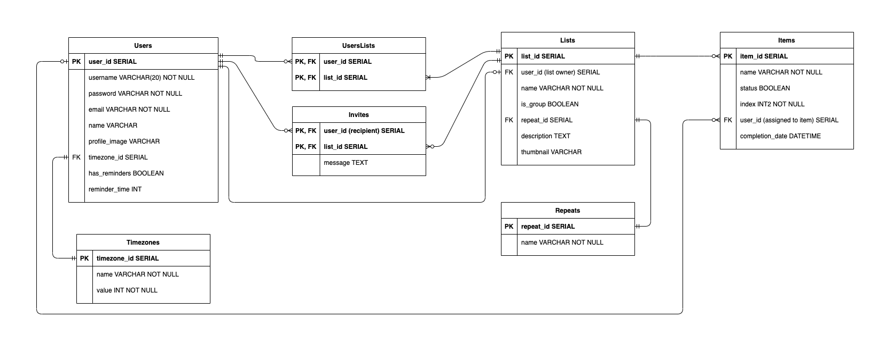

# Check It :white_check_mark:

This app aims to help users manage checklists of tasks to avoid the hassle of having to remember everything in our busy lives. The core functionality of the app will allow you to:
- [x] Create new lists with an accompanying title, description (optional) and thumbnail image (optional)
- [x] Edit current lists, including the ability to:
    - [x] Check items off after you complete them
    - [x] Reset lists to uncheck all list items
    - [x] Add list items
    - [x] Delete list items
    - [x] Rearrange list items
- [x] Delete lists
- [x] Set lists to be repeated daily or weekly which automatically resets the list at the appropriate time.

Additional functionality that may not be implemented in the initial release includes:
- [ ] Group lists, including the ability to:
    - [ ] Invite other Check It users to the list
    - [ ] Assign each list item to a specific member of the group list for them to complete or leave it unassigned so that anyone can complete it
    - [ ] Tracking for who completed each list item and when
- [ ] Reminders that can be set to a certain time of day to remind you of any outstanding tasks that require your attention.

Using the app requires an account which allows your list data to be synchronised between multiple devices so that you can use the app on your phone or computer and pick up right where you left off.

---

## Table of Contents
- [Installation](#installation)
- [Implementation Plan](#implementation-plan)
- [CI/CD](#ci-cd)
- [Wireframes](#wireframes)
- [Database Schema](#database-schema)
- [Endpoint Documentation](#endpoint-documentation)

## Installation

1. Clone the repository, `git clone https://github.com/AndrewGregorovic/check_it.git`
2. Navigate to the app directory, `cd <path/to/directory>/check_it`
3. Install a virtual environment, `python3 -m venv venv`
    > Install the venv module if you are missing it, `pip3 install venv`
4. Activate the environment, `source venv/bin/activate`
5. Install dependencies, `pip install -r requirements.txt`
6. Run the app, `python src/main.py`

## Implementation Plan

The development of this project is being tracked with the Github Projects section of this repository. The link is included below for easy navigation to the project board,

[https://github.com/AndrewGregorovic/check_it/projects/1](https://github.com/AndrewGregorovic/check_it/projects/1)

## CI/CD

The CI/CD workflow for this project makes use of github actions to perform the set up for jobs and runs on the latest stable version of Ubuntu.

> Currently only the continuous integration part of the workflow is implemented while the project is in it's initial stages.

The workflow is initiated when commits are pushed to the master branch, it uses Python 3.9.0 to run the automated unit tests and code checks to determine if the code is in working order.

## Wireframes

#### Landing Page
Initial page that is seen when visited by users who either don't have an account or aren't logged in yet. Gives a little discription of the app and a screenshot of it to the side, along with buttons/links to log in or sign up.

The app name at the top left should link back to this page if there is no logged in user, otherwise it should link to the user's dashboard page.

#### Log In/Sign Up Page
Basic log in or sign up page, the background could be another screenshot of the app or some other stylish designs so that it isn't a plain white background. Rather than a separate page, this could be a card or window that appears on top of the landing page.

#### Dashboard Page
The dashboard shows the Daily and Weekly lists for the current user. The arrows are used when there's multiple lists in each category for the user to navigate between while staying on the dashboard. The circles by each checklist name are optional thumbnail images that can be uploaded for each list.

The circle by the user name in the top right is the user's profile picture, the picture + user name when clicked will show a dropdown with options to view profile details or log out.

If lists have more items than can be viewed on the screen, make the list scrollable within it's section. When the list title or thumbnail image is clicked it opens the view list page for that list. When a list item is clicked it toggles the checkbox for that item.

#### User Profile Page
Displays the different pieces of profile information. The user name, name and email fields are editable text fields. The box under the Password section is only visible when the Change Password button is clicked.

When changes are made to any part of the user's account details the back button at the bottom of the page is replaced by two additional buttons, one to save all the changes and another to cancel the changes. The back button returns the user to their dashboard page.

Uploading a new profile image is separate to changing any other account details and takes effect immediately after uploading. It does not count as a change that needs to be saved in the same way you would need to click the save button if a user wanted to change their name for example.

#### Saved Lists Page
This displays all the lists that the user is currently linked to, this includes their personal lists and group lists whether they are the list owner or just a member. There is set of options that show to allow the user to filter their lists (needs some sort of indication of being selected). Having a large number of lists will grow the list down and create a vertical scrollbar.

The whole tile for each list will link to the view list page for that list. The top right of each tile indicates if the list repeats daily, weekly or not at all, if not at all there is no daily/weekly label. There is also a label for group lists, again the absence of a group label means that it is a personal list.

#### Create List Page
This card/window can be created on top of the page currently being viewed or can be a separate page with something in the background. When create list is clicked it takes the user to the edit list page for the newly created list so that they can begin adding items to it or include any of the optional elements.

#### View Personal List Page
This page is viewed when a list is clicked on. Clicking list items on this page will toggle their checkbox, this is the only page other than the dashboard where list items can be toggled between checked and not checked. The reset button at the top right of the list view can be clicked to reset the completion state of all the lists items, i.e. it marks everything as not completed. Clicking back takes the user back to their dashboard page.

#### Edit Personal List Page
To implement the ability to rearrange list items, either allow each item to be dragged up and down with the mouse or need to add in up/down buttons that appear for the item currently moused over which can move the item in the appropriate direction.

#### Group List Invite Send/Receive
The card/window for creating and sending an invite can be created on top of the view group list page as that is the only place where you can invite people from. The email address is used to get the recipient's user id.

The card/window for receiving an invite can be created on top of any page when the user clicks to view the invite, not sure where to put this but there needs to be some sort of notification indicator or something to tell the user if they have a pending invite.

#### View Group List Page
Similar to the page for personal lists however it includes additional details aimed towards group lists. There is no reset button for group lists currently as I feel its much less likely that a user would want to reset a group list and there is still the repeat frequency option for group lists that need to be reset regularly.

#### Edit Group List Page
Again similar to the edit personal list page, only difference is the additional option to assign group members to each list item.

## Database Schema

The schema for the database used in this app is shown below.
- It is optional for a user to create any checklists but each checklist must have one user who created it.
- Each checklist must have at least 1 item in it.
- Each item is only used in 1 list. A single item cannot be used multiple times whether in the same list or multiple lists, this is because the checked state of each item needs to be tracked independently.

## Endpoint Documentation

To view the included endpoint documentation for this app you will need to do one of the following:
- Go to [https://editor.swagger.io/#](https://editor.swagger.io/#), select File > Import file and then select the `swagger.yml` file located in the `docs` folder.
- If your chosen IDE has an OpenAPI/Swagger viewer plugin then you can simply install it, open the `swagger.yml` file in your IDE and use the plugin to view the documentation.